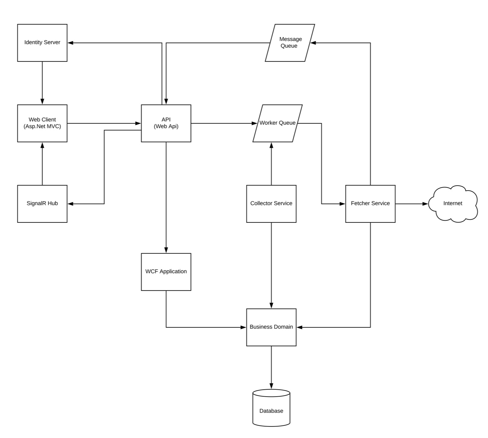

# RSSApp
RSS Application

 
Components
1. Identity Server - IdentityServer3
2. Web Client - Asp.Net MVC 5
3. SignalR - for realtime data
4. API - Web Api 2
5. Fetcher Service - Windows Service
6. Collector Service - Windows Service
7. Message Queue - Rabbitmq
8. Worker Queue - Rabbitmq
9. WCF Application
Authentication and Authorization Flow
1. Web Client requests authentication token from Identity Server.
2. API receives token from client and checks againts Identity Server to verify if valid. If valid API gives the Web Client access to resources

Adding RSS Url
1. Web Client sends RSS url added by user to API
2. API publishes message containing RSS url as payload to Worker Queue
3. Fetcher Service consumes messages from Worker Queue and receives message containing RSS url as payload. It then processes RSS url by fetching the data from the external network (Internet). The data are the list of articles. Fetcher Service then publishes this articles to Message Queue
4. API consumes messages from Worker Queue.  API publishes new Articles to SignalR Hub
5. Web Client listens to SignalR Hub for new articles to show to user

Client-Server Interaction
1. Web Client requests for Channels(added RSS urls) and Articles
2. API receives requests and invokes WCF service 
3. WCF Services interacts with Channel and Article Repositories
4. WCF returns result to API and then API returns request to Web Client

Collector Service - runs every thirty minutes and fetches all RSS urls not updated for more than an hour. Then publishes all RSS articles to Worker Queue with outdated urls

Fetcher service runs indefinitely and listens for messages from Worker Queue that needs processing
